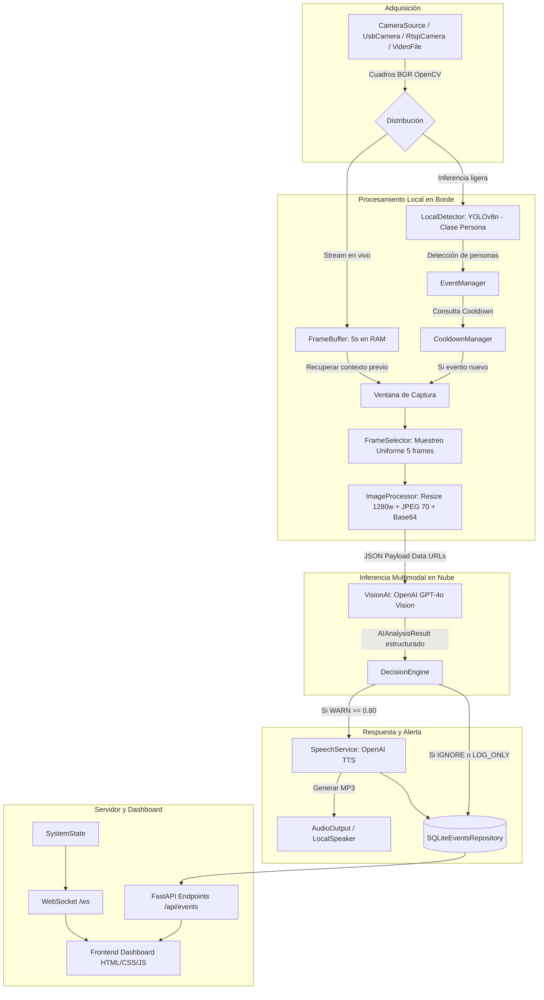

# Documentación Técnica Detallada — Huallaga AI Monitor (v0.1)

**Sistema inteligente de vigilancia ambiental para la detección preventiva del arrojo de residuos sólidos en la ribera del río Huallaga**  
*Universidad Nacional Hermilio Valdizán (UNHEVAL) — Proyecto CyT Huallaga 2026-II*

---

## 1. Introducción y Contexto del Proyecto

El río Huallaga en la provincia de Leoncio Prado (Tingo María, Huánuco, Perú) es una arteria ecológica vital con alta biodiversidad y fuente primaria de agua para consumo, agricultura y actividades comunitarias. Sin embargo, sufre una severa presión antropogénica por vertimientos clandestinos y arrojo indiscriminado de residuos sólidos (plásticos, empaques, desechos) en sus riberas.

**Huallaga AI Monitor** es un sistema modular de computación en el borde (Edge Computing) e Inteligencia Artificial Multimodal diseñado para:
1. Detectar de manera continua y económica la presencia de personas en zonas de vigilancia.
2. Capturar temporalmente secuencias de video relevantes.
3. Evaluar mediante IA de visión multimodal si se trata de una conducta de arrojo o abandono de basura.
4. Generar y emitir advertencias acústicas en tiempo real a través de altavoces para disuadir la contaminación antes de que los residuos alcancen el caudal.
5. Recopilar métricas de latencia, compresión y precisión para la investigación científica.

---

## 2. Diagrama de Arquitectura y Flujo de Datos

El sistema implementa una arquitectura desacoplada por capas:

---

## 3. Desglose Módulo por Módulo

### 3.1. Adquisición de Video (`app/camera/`)
- **`CameraSource` (`base.py`)**: Interfaz abstracta que estandariza los métodos `open()`, `read()`, `close()`, `is_opened()` y `get_metadata()`.
- **`UsbCamera` (`usb_camera.py`)**: Implementación para webcams conectadas por USB mediante OpenCV `cv2.VideoCapture`. En Windows utiliza `CAP_DSHOW` para inicialización ultra-rápida.
- **`RtspCamera` (`rtsp_camera.py`)**: Implementación preparada para streams de cámaras IP y de seguridad mediante URLs `rtsp://...`.
- **`VideoFileCamera` (`video_file.py`)**: Reproductor de grabaciones (`.mp4`, `.avi`) con soporte para bucle (`loop=True`), permitiendo experimentos repetibles y benchmarks controlados.

---

### 3.2. Visión por Computadora y Buffer (`app/vision/`)
- **`LocalDetector` (`detector.py`)**: Utiliza Ultralytics YOLO (`yolov8n.pt`) para identificar exclusivamente personas (`clase 0`). Actúa como **filtro barato**: si no hay personas presentes, no se consume red ni tokens de IA.
- **`FrameBuffer` (`frame_buffer.py`)**: Cola circular en memoria RAM (`collections.deque(maxlen=N)`) que retiene los últimos 5 segundos de video. Permite a la IA analizar el contexto temporal previo a la acción sospechosa.
- **`FrameSelector` (`frame_selector.py`)**: Selecciona $N$ imágenes clave (por defecto 5) aplicando un muestreo temporal uniforme equidistante a lo largo de la ventana de captura.
- **`ImageProcessor` (`image_processor.py`)**: Redimensiona las imágenes (ancho máximo 1280 px), aplica compresión JPEG de calidad controlada (calidad 70) y genera cadenas Base64 Data URL listas para transmisión.
- **`Tracker` (`tracker.py`)**: Interfaz para asociar identificadores persistentes a personas a lo largo de varios fotogramas.

---

### 3.3. Gestión de Eventos y Reglas (`app/events/`)
- **`CooldownManager` (`cooldown.py`)**: Temporizador de enfriamiento (por defecto 10 segundos) que evita disparar múltiples llamadas consecutivas a la API si una persona permanece en cámara.
- **`EventManager` (`manager.py`)**: Coordina el ciclo de vida del evento (`created` $\to$ `capturing` $\to$ `analyzing` $\to$ `completed`) y crea el objeto `EventModel` con UUID v4.
- **`DecisionEngine` (`rules.py`)**: Aplica las políticas de decisión:
  * $\text{Confianza} < 0.50 \implies \text{IGNORE}$ (Descartar).
  * $0.50 \le \text{Confianza} < 0.80 \implies \text{LOG_ONLY}$ (Auditar en base de datos sin emitir sonido).
  * $\text{Confianza} \ge 0.80 \text{ y evento de arrojo} \implies \text{WARN}$ (Emitir advertencia por voz).

---

### 3.4. Inteligencia Artificial Multimodal y Audio (`app/ai/` y `app/speech/`)
- **`VisionAI` (`vision_client.py`)**: Cliente de inferencia para OpenAI Vision (`gpt-4o`). Emplea structured outputs (`beta.chat.completions.parse`) con el modelo Pydantic `AIAnalysisResult`.
  * *Modo Standby / Fallback*: Si no hay API Key configurada, opera en modo simulación seguro sin interrumpir la ejecución.
- **`load_system_prompt` (`prompts.py`)**: Carga las instrucciones del archivo externo [`prompts/environmental_event.txt`](file:///e:/OneDrive/myf-proyecto-cyt/prompts/environmental_event.txt).
- **`OpenAISpeechService` (`openai_tts.py`)**: Genera archivos de audio `.mp3` mediante el endpoint `/v1/audio/speech` utilizando la voz configurada (`alloy`).
- **`LocalSpeakerOutput` (`audio_output.py`)**: Reproduce el audio sintetizado en los altavoces de la estación.

---

### 3.5. Persistencia y Métricas (`app/storage/` y `app/metrics/`)
- **`SQLiteEventsRepository` (`local_repository.py`)**: Base de datos relacional ligera integrada (`data/events.db`). Almacena los eventos serializados en formato JSON completo.
- **`LatencyTimer` (`latency.py`)**: Cronómetro de alta resolución para medir latencias de red, tiempo de inferencia y tiempo total del pipeline.
- **`NetworkMetrics` (`network.py`)**: Mide el tamaño en bytes del payload transmitido.
- **`MetricsCollector` (`collector.py`)**: Agrega los registros experimentales para análisis y exportación científica.

---

### 3.6. API REST y WebSockets (`app/api/` y `app/main.py`)
- **Controladores REST**:
  * `GET /api/status`: Estado global del sistema (`SystemState`).
  * `GET /api/health`: Sonda de salud y disponibilidad.
  * `GET /api/events`: Historial de eventos recientes.
  * `GET /api/events/{id}`: Detalle completo de un evento por ID.
  * `GET /api/cameras/status`: Estado técnico y resolución de la cámara.
  * `GET /api/config` & `PATCH /api/config`: Consulta y ajuste de parámetros en tiempo de ejecución.
  * `POST /api/debug/test-speech`: Prueba manual de generación y salida de voz.
- **Canal WebSocket**:
  * `WS /ws`: Difusión bidireccional reactiva cada 2 segundos con las métricas en vivo.

---

## 4. Frontend Dashboard (`frontend/`)

Desarrollado en **HTML5, Vanilla CSS y Vanilla JavaScript**:
- **`index.html`**: Estructura semántica con vista previa de cámara, contadores de personas, barra de confianza de IA, visualizador de advertencias emitidas y tabla histórica de eventos.
- **`css/app.css`**: Diseño moderno en modo oscuro con efectos glassmorphism, tipografía Google Fonts (*Outfit* y *JetBrains Mono*) y componentes responsivos.
- **`js/websocket.js`**: Cliente WebSocket con reconexión automática y tolerancia a fallos.
- **`js/api.js`**: Cliente REST para consultas HTTP.
- **`js/dashboard.js`**: Actualizador reactivo del DOM.

---

## 5. Principio Ético y de Privacidad

> [!IMPORTANT]
> El sistema está diseñado estrictamente para la **vigilancia ambiental de conductas y objetos**, NO para el reconocimiento facial ni la identificación biométrica de ciudadanos.
> - No se extraen características biométricas faciales.
> - No se almacenan nombres, documentos de identidad (DNI) ni identificadores personales.
> - La detección local de YOLO solo cuantifica la presencia general de la clase `person`.
