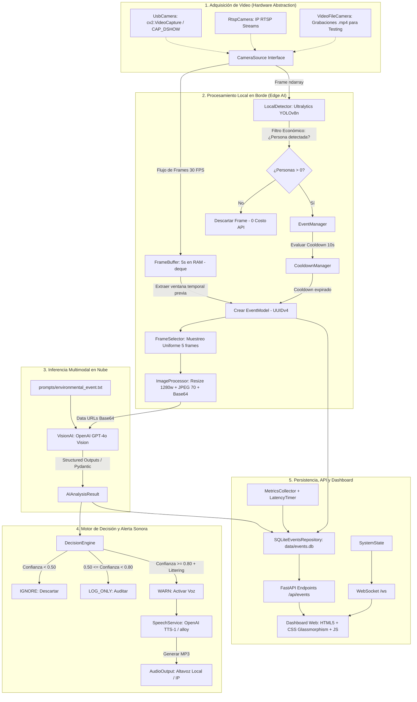

# Documentación Técnica y Arquitectura del Sistema — Huallaga AI Monitor (v0.1)

**Investigación sobre la Problemática del Arrojo de Residuos Sólidos en las Riberas del Río Huallaga y Estrategias Preventivas Basadas en Inteligencia Artificial**  
*Universidad Nacional Hermilio Valdizán (UNHEVAL) — Facultad de Ingeniería / Proyecto de Investigación Aplicada CyT (2026-II)*

---

## 1. Fundamento y Contexto del Proyecto

### 1.1. Delimitación Geográfica del Área de Estudio
La investigación se circunscribe a la **cuenca media del río Huallaga** a su paso por el continuo urbano formado por los distritos de **Huánuco, Amarilis y Pillco Marca** (provincia y departamento de Huánuco, Perú).

El foco prioritario de intervención se ubica en el corredor de alta fricción urbana que articula los distritos de Pillco Marca y Amarilis a través del **Puente Huallaga** y sus vías ribereñas adyacentes:
- **Malecón Walker Soberón** (margen derecha).
- **Malecón Huallaga** (margen izquierda).
- **Zona de influencia de la sede principal de la UNHEVAL** (sector de Cayhuayna, Pillco Marca).
- **Puente Esteban Pavletich** y fajas marginales colindantes.

```
                  ┌────────────────────────────────────────────────────────┐
                  │          ÁREA METROPOLITANA DE HUÁNUCO                │
                  │  (Huánuco Centro ── Amarilis ── Pillco Marca/Cayhuayna)│
                  └─────────────────────────┬──────────────────────────────┘
                                            │
                                            ▼
                           EJE FLUVIAL DEL RÍO HUALLAGA
                 ┌──────────────────────────────────────────────────┐
                 │ • Puente Huallaga (Nodo vial crítico)            │
                 │ • Malecón Walker Soberón / Malecón Huallaga       │
                 │ • Acceso peatonal masivo a la UNHEVAL            │
                 └──────────────────────────────────────────────────┘
```

### 1.2. Diagnóstico de la Problemática Ambiental
- **Volumen de generación:** Los distritos de Huánuco, Amarilis y Pillco Marca generan conjuntamente entre **100 y 120 toneladas diarias de residuos sólidos**.
- **Puntos críticos:** Los organismos fiscalizadores (OEFA, FEMA, ANA y municipalidades) han documentado **216 puntos críticos** a lo largo de la cuenca en la región Huánuco, incluyendo al menos **50 puntos críticos en Amarilis** y **19 en Pillco Marca**.
- **Composición de los residuos:** Predominan residuos inorgánicos de descarte rápido como **botellas de plástico PET, bolsas de polietileno, envases de tecnopor y restos de cartón**, junto con residuos orgánicos domésticos y escombros de construcción.

### 1.3. Delimitación Rigurosa de las Fuentes de Contaminación
Para salvaguardar el rigor científico y evitar falsas pretensiones tecno-solucionistas, el proyecto delimita estrictamente las fuentes documentadas:

| Fuente de Contaminación | Descripción | Alcance de Huallaga AI Monitor |
| :--- | :--- | :--- |
| **1. Disposición directa por personas (*Littering*)** | Arrojo intencional o negligente de botellas, bolsas y envoltorios por peatones, estudiantes y conductores. | **🎯 ENFOQUE EXCLUSIVO DEL PROYECTO.** |
| **2. Residuos transportados por la corriente** | Plásticos arrastrados desde cuencas altas o distritos vecinos por lluvia y caudal. | Fuera de alcance (requiere infraestructura hidráulica/dragado). |
| **3. Vertimientos de aguas residuales** | Descargas de alcantarillado sin tratamiento y efluentes orgánicos (ej. Camal Municipal). | Fuera de alcance (requiere plantas de tratamiento de aguas residuales - PTAR). |
| **4. Escombros masivos de construcción** | Descarga clandestina nocturna con camiones de carga pesada. | Fuera de alcance inicial (requiere fiscalización policial/municipal). |
| **5. Agroquímicos y lixiviados** | Percolación de botaderos (Chilepampa) e insumos agrícolas periurbanos. | Fuera de alcance algorítmico. |

---

## 2. Fundamentos Teóricos y de Comportamiento Humano

### 2.1. De la Reacción a la Prevención (*Nudges* Cognitivos)
Las estrategias tradicionales en Huánuco han sido **predominantemente reactivas** (campañas de limpieza periódicas convocadas por la UNHEVAL, municipalidades y voluntariados como *EcoTrueque* o *León de Huánuco*). Aunque valiosas, sus efectos físicos son efímeros: a los pocos días, los puntos críticos se regeneran por la reincidencia conductual.

El sistema introduce una **intervención preventiva en el instante pre-impacto**:
1. **Teoría del Pensamiento Dual (Kahneman):** El arrojo de basura (*littering*) suele ser un acto impulsivo de bajo esfuerzo mental (**Sistema 1 automático**). Una advertencia acústica personalizada e inmediata interrumpe el piloto automático y activa el razonamiento consciente (**Sistema 2 reflexivo**).
2. **Teoría de las Ventanas Rotas:** La presencia previa de basura transmite una señal de permisividad social; la intervención algorítmica frena la degradación inicial del espacio.
3. **Teoría de la Disuasión (*Deterrence Theory*):** Al percatarse de que el acto físico es detectado en tiempo real, el infractor pierde el escudo del anonimato y desiste de arrojar el residuo para evitar la sanción social (*shame effect*).

---

## 3. Arquitectura del Sistema Tecnológico

El sistema adopta un enfoque modular basado en **Computación en el Borde (Edge Computing)** desacoplado en capas independientes:



---

## 4. Especificación Detallada de Módulos

### 4.1. Adquisición de Video (`app/camera/`)
- **`CameraSource` (`base.py`)**: Interfaz abstracta que define las operaciones polimórficas de captura (`open`, `read`, `close`, `is_opened`, `get_metadata`).
- **`UsbCamera` (`usb_camera.py`)**: Conexión a cámaras USB locales. En entornos Windows emplea `cv2.CAP_DSHOW` para evitar bloqueos en el hilo principal.
- **`RtspCamera` (`rtsp_camera.py`)**: Controlador para cámaras de videovigilancia IP profesionales instaladas en fajas marginales.
- **`VideoFileCamera` (`video_file.py`)**: Reproductor de video local (`.mp4`, `.avi`) con rebobinado automático (`loop=True`). Permite realizar **pruebas controladas y reproducibles** con grabaciones de campo tomadas en el Puente Huallaga y el Malecón Walker Soberón.

### 4.2. Visión por Computadora Local (`app/vision/`)
- **`LocalDetector` (`detector.py`)**: Carga el modelo `yolov8n.pt` para la detección de personas (clase `person` / ID 0 en COCO). Funciona como **filtro barato**: si el encuadre está vacío, se descarta el procesamiento pesado.
- **`FrameBuffer` (`frame_buffer.py`)**: Estructura circular en memoria RAM (`deque(maxlen=N)`) que retiene continuamente los últimos 5 segundos a 30 FPS. Permite recuperar la historia visual inmediatamente anterior al inicio del evento.
- **`FrameSelector` (`frame_selector.py`)**: Reduce la ráfaga de 30–150 fotogramas del buffer a una secuencia estandarizada de 5 fotogramas clave mediante muestreo temporal uniforme.
- **`ImageProcessor` (`image_processor.py`)**: Escala la imagen (máximo 1280 px), aplica compresión JPEG (calidad 70) y la codifica a Base64 Data URL (`data:image/jpeg;base64,...`).

### 4.3. Gestión de Eventos y Lógica de Decisión (`app/events/`)
- **`CooldownManager` (`cooldown.py`)**: Bloquea la reactivación de alertas durante 10 segundos tras un evento para evitar fatiga de alarma y saturación de API.
- **`EventManager` (`manager.py`)**: Orquesta el ciclo de vida del evento: inicialización, recolección de contexto temporal, cierre y entrega al repositorio.
- **`DecisionEngine` (`rules.py`)**: Evalúa el dictamen de IA y clasifica la acción en:
  * `IGNORE`: No hay evento o confianza menor al 50%.
  * `LOG_ONLY`: Confianza entre 50% y 79%, o actividad ambigua (portar mochilas, sentarse, colocar pertenencias).
  * `WARN`: Confianza $\ge 80\%$ y conducta identificada como `possible_littering`.

### 4.4. Inteligencia Artificial y Síntesis de Voz (`app/ai/` y `app/speech/`)
- **`VisionAI` (`vision_client.py`)**: Cliente de visión multimodal (OpenAI `gpt-4o`) configurado con Structured Outputs (`beta.chat.completions.parse`) para devolver directamente instancias validadas de `AIAnalysisResult`.
  * *Modo Simulación (Fase 0):* Si no se provee `OPENAI_API_KEY`, opera en modo simulación seguro sin interrumpir el servidor.
- **`load_system_prompt` (`prompts.py`)**: Carga dinámicamente el prompt de [`prompts/environmental_event.txt`](file:///e:/OneDrive/myf-proyecto-cyt/prompts/environmental_event.txt).
- **`OpenAISpeechService` (`openai_tts.py`)**: Convierte el texto de advertencia a audio MP3 utilizando el modelo `tts-1` y la voz `alloy`.
- **`LocalSpeakerOutput` (`audio_output.py`)**: Emite el sonido generado a través de los altavoces de la estación.

### 4.5. Persistencia y Métricas Experimentales (`app/storage/` y `app/metrics/`)
- **`SQLiteEventsRepository` (`local_repository.py`)**: Base de datos relacional embebida (`data/events.db`) que guarda el JSON completo de cada evento sin dependencias de red.
- **`LatencyTimer` (`latency.py`)**: Context manager de alta precisión (`time.perf_counter`) para registrar la latencia de inferencia y el tiempo de reacción acústica.
- **`NetworkMetrics` (`network.py`)**: Estima el tamaño del payload en bytes transferido a la API.
- **`MetricsCollector` (`collector.py`)**: Mantiene el historial de rendimiento para cálculos estadísticos.

### 4.6. API REST y WebSockets (`app/api/` y `app/main.py`)
- **Servidor FastAPI (`app/main.py`)**: Expone endpoints REST (`/api/status`, `/api/health`, `/api/events`, `/api/cameras`, `/api/config`, `/api/debug/test-speech`) y monta el canal WebSocket `/ws`.
- **WebSocket (`websocket.py`)**: Emite latidos de estado cada 2 segundos a todas las pestañas conectadas.

---

## 5. Esquemas de Datos Pydantic

### 5.1. Esquema de Inferencia Multimodal (`AIAnalysisResult`)
```json
{
  "person_detected": true,
  "suspected_disposal": true,
  "action_completed": true,
  "confidence": 0.92,
  "event_type": "WASTE_DISPOSAL",
  "description": "El transeúnte camina por la faja marginal del Malecón Walker Soberón y arroja una botella hacia la pendiente del río.",
  "warning_message": "Atención. Por favor, recuerde recoger su botella y depositarla en los tachos habilitados. Cuidemos la ribera del río Huallaga."
}
```

### 5.2. Esquema del Evento (`EventModel`)
```json
{
  "id": "3fa85f64-5717-4562-b3fc-2c963f66afa6",
  "camera_id": "CAM_HUALLAGA_001",
  "started_at": "2026-08-21T10:30:00.000Z",
  "ended_at": "2026-08-21T10:30:03.500Z",
  "status": "completed",
  "local_detection": {
    "persons": 1,
    "max_confidence": 0.94,
    "detections": [{ "label": "person", "confidence": 0.94, "bbox": { "x1": 100, "y1": 150, "x2": 320, "y2": 600 } }]
  },
  "capture": {
    "total_frames": 90,
    "selected_frames": 5,
    "jpeg_quality": 70,
    "frame_paths": []
  },
  "analysis": { ... },
  "decision": "WARN",
  "metrics": {
    "ai_latency_ms": 1420.5,
    "tts_latency_ms": 610.2,
    "total_latency_ms": 2180.7,
    "payload_bytes": 185420
  }
}
```

---

## 6. Variables e Indicadores para la Investigación Científica

El prototipo recolecta métricas empíricas para validar las hipótesis del proyecto:

| Variable | Tipo | Indicador Medible |
| :--- | :--- | :--- |
| **Operación del Sistema** | Independiente | Estado (0: Apagado/Línea Base, 1: Monitoreo Silente, 2: Alerta Sonora Activa). |
| **Eficacia Algorítmica** | Dependiente Tecnológica | - *Accuracy* (Exactitud global del modelo).<br>- *Recall* (Tasa de Verdaderos Positivos).<br>- *False Positive Rate* (Tasa de Falsas Alarmas).<br>- Latencia de respuesta en milisegundos ($ms$). |
| **Respuesta Conductual** | Dependiente Social | - Tasa de eventos de *littering* por franja horaria.<br>- **Porcentaje de Desistimiento:** $\frac{\text{Eventos donde la persona retiene/recoge el residuo}}{\text{Total de alarmas sonoras emitidas}} \times 100$. |
| **Impacto Ambiental** | Dependiente Ambiental | Masa de basura fresca ($\text{Kg}$) y conteo de plásticos PET en cuadrantes de control antes y después de la intervención. |

---

## 7. Marco Ético y Cumplimiento Normativo Peruano

Para garantizar el irrestricto respeto a los derechos ciudadanos en el espacio público (Puente Huallaga, Malecones):

1. **Ley N° 29733 (Protección de Datos Personales) y Directiva N° 01-2020-JUS/DGTAIPD:**
   - **Anonimización por Diseño (*Privacy by Design*):** El sistema detecta **siluetas y patrones biomecánicos**, NO identidades civiles.
   - **Prohibición de Biometría:** El código **NO incluye reconocimiento facial** ni almacena nombres, rostros o números de DNI.
   - **Deber de Información:** Se contempla la instalación de carteles informativos visibles en las zonas monitorizadas, lo que refuerza el estímulo visual disuasorio (*nudge*).
   - **Minimización de Datos:** Los fotogramas sin personas o sin eventos de contaminación se descartan de la memoria volátil instantáneamente; solo se guardan registros tabulares y métricas estadísticas anonimizadas.
2. **Ley N° 30120:** Regula el empleo de tecnologías de videovigilancia orientadas al bienestar común y la seguridad en áreas públicas.
